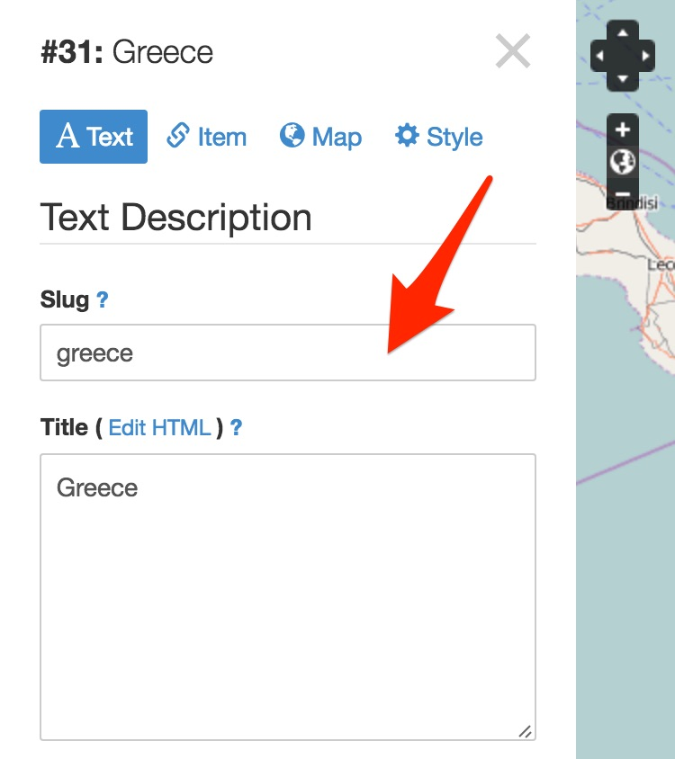
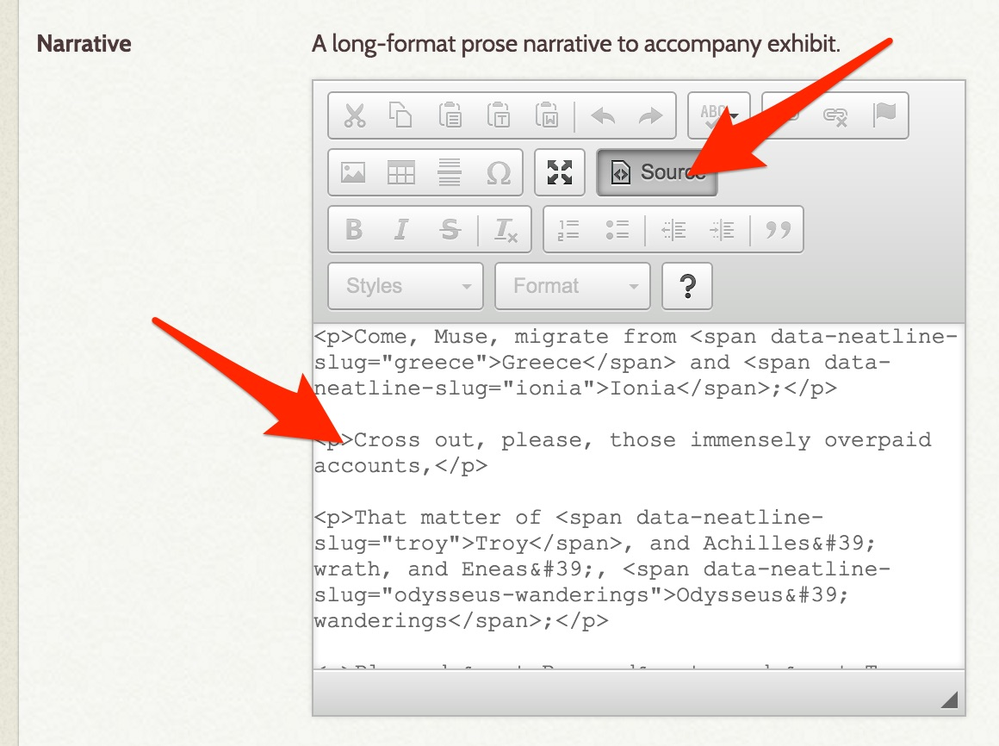
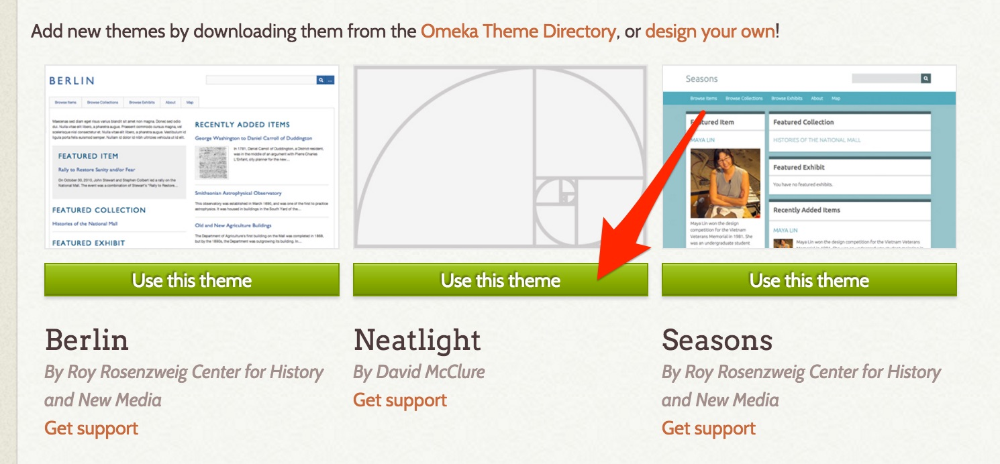

# Create an interactive spatial edition of a text

Next, we'll use the Neatline Text extension to make a spatially-enabled edition of a text document.

## Install NeatlineText

1. Go to http://omeka.org/add-ons/plugins/ and find the **Neatline Text** plugin. Click **Download v1.1.0**.

1. Open the zip file and copy the `NeatlineText` folder.

1. Copy the folder into the Omeka plugins directory, alongside `Neatline` and `NeatlineSimile`.

1. Open up the Omeka admin interface and click **Plugins** in the top navbar.

1. Install the **Neatline Widget ~ Text** plugin.

## Mark up a text

Now, find a chunk of text (something not too long, maybe a couple of paragraphs) that references geographic locations. I'm going to use a stanza from a poem from _Leaves of Grass_ called "Song of the Exposition," where Whitman is asking the "Muse" to migrate from the traditional scenes of epic poetry in ancient Greece and Europe to the "better, fresher, busier sphere" in the United States:

```
Come, Muse, migrate from Greece and Ionia;
Cross out, please, those immensely overpaid accounts,
That matter of Troy, and Achilles' wrath, and Eneas', Odysseus' wanderings;
Placard "Removed" and "To Let" on the rocks of your snowy Parnassus;
Repeat at Jerusalem — place the notice high on Jaffa's gate, and on Mount Moriah;
The same on the walls of your Gothic European Cathedrals, and German, French and Spanish Castles;
For know a better, fresher, busier sphere — a wide, untried domain awaits, demands you.
```

Before we can plot this in Neatline, we need to wrap them with HTML elements that mark off where the toponyms are in the text. For each place reference, add a `<span>` tag with a `data-neatline-slug` attribute with a human-readable value that makes sense for the text that's been annotated. Eg:

```html
<span data-neatline-slug="greece">Greece</span>
```

So, for example, the first line would become:

```html
Come, Muse, migrate from <span data-neatline-slug="greece">Greece</span> and <span data-neatline-slug="ionia">Ionia</span>;
```

## Create the Neatline exhibit

1. Create a new Neatline exhibit for the text.

1. Open the editor, and create records for each of the place names annotated in the text. In each record, fill in the **Slug** field with the value in the `data-neatline-slug`. Eg, when plotting out "Greece," just put `greece` in **Slug**. This is how Neatline links up the HTML with the records.

  

1. Once the records are plotted out, go back to the exhibit browse view, and click the **Exhibit Settings** link for the exhibit.

1. In the **Narrative** field, click on the **Source** button to flip on HTML mode. Paste in the raw HTML markup of the text.

  

1. Save the exhibit.

1. Click on **Public View**. Neatline Text will automatically position the text on the right side of the exhibit, but the exhibit itself is still embedded inside of the surrounding Omeka theme, which takes a lot of screen real estate away from the map.

## Install Neatlight

To fix this, let's install a theme called Neatlight, which was specifically designed to work well with these types of interactive narratives.

1. Go to https://github.com/davidmcclure/neatlight and click **Clone or Download > Download ZIP**.

1. Copy the `neatlight-master` folder and paste it into the `themes` directory inside of Omeka, alongside `berlin` and `default`.

1. In the Omeka admin, click on **Appearance** and find the listing for "Neatlight." Click **Use this theme** to activate it. Now, go back to the public view for the exhibit, and the fullscreen layout will be displayed.

  
