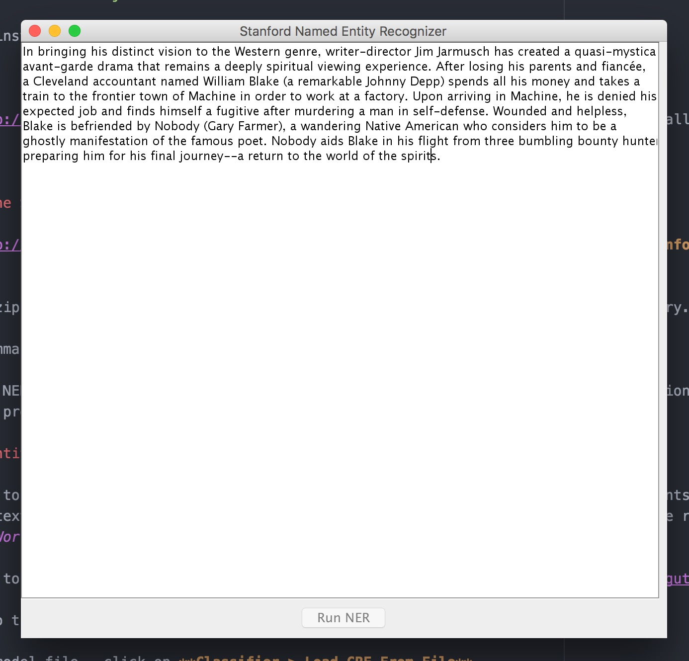
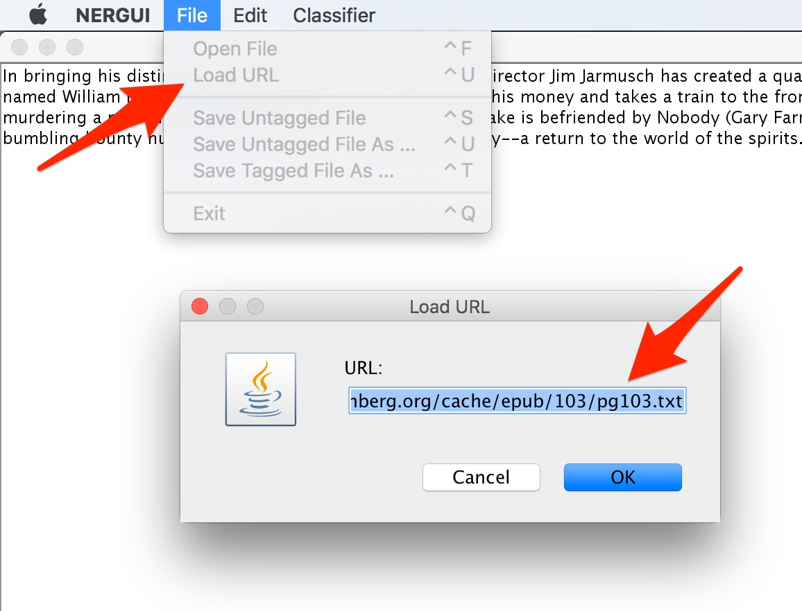
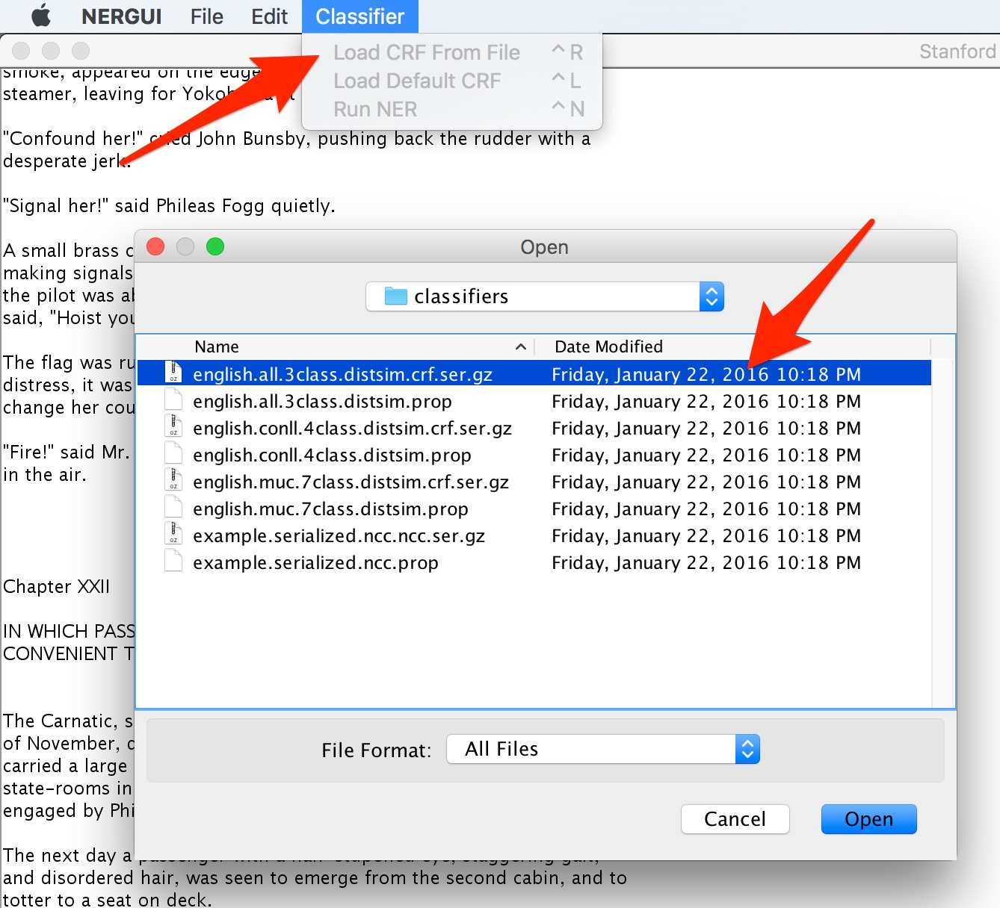

# NER + Geocoding

Now that we've spent some time experimenting with tools designed for an interpretive, hand-crafted mode of GIS work, let's move to the other end of the spectrum and work with some larger data sets. As a test project, we're going to be extracting "toponyms" - place references - from novels. It would take weeks or months to do this by hand - we'd have to read the entire novel, highlight each of the place references by hand, and then manually everything into some kind of database at the end.

Instead, we're going to use a piece of software called the Stanford Named Entity Recognizer to automatically pick out words or phrases in a text that are proper names. Then, we'll write a simple Python script that passes the extracted toponyms through a geocoding API, which takes the raw location names and converts them into latitude / longitude points that can be plotted on a map.

At the end of the process, we'll have a nicely-formatted CSV file that can be imported into visualization tools like Google Fusion Tables and CartoDB.

## Install Java

---

**MAC**

1. Run `brew cask install java`.

1. When the install finishes, run `java -version`. You should see `java version "1.8.0_92"`.

**WINDOWS**

1. Go to http://java.com/en/download/, download the latest version of Java, and run the installer.

---

## Install the Stanford Named Entity Recognizer

1. Go to http://nlp.stanford.edu/software/CRF-NER.shtml#Download and click on **Download Stanford Named Entity Recognizer version 3.6.0**.

1. Open the zip file and copy the `stanford-ner-2015-12-09` folder to the `Projects` directory.

1. On the command line, change down into `stanford-ner-2015-12-09`.

1. Start the NER application with: `java -jar stanford-ner.jar`. This will open the application in a separate window. Leave the command line program running in the background.

  

## Extract entities from a novel

1. Head over to http://www.gutenberg.org/ (or anywhere else on the web with full-text documents of interest) and find some kind of interesting text to work with. Try to use something that will have a lot of interesting place references. I'll use Jules Verne's _Around the World in Eighty Days_, which should have plenty!

1. Get a URL to a web page that just contains the raw text of the document. Eg, `http://www.gutenberg.org/cache/epub/103/pg103.txt`.

1. Go back to the NER application and click **File > Load URL**. Paste in the URL.

  

1. Load the model file - click on **Classifier > Load CRF From File**.

1. In the file browser, find the `stanford-ner-2015-12-09` folder and open up "classifiers." Select the **english.all.3class.distsim.crf.ser.gz** file and click **Open**.

  

1. Click **Run NER** to run the model. Depending on the length of the text, this should take 10-20 seconds. When it's done, you should see colored highlights on entities in the text.

1. Save a tagger version of the file. Click **File > Save Tagged File As** and save the file back into the `stanford-ner-2015-12-09` directory.

1. In Atom, open up the file and take a look at the markup that the NER generated. The place names are now wrapped in `<LOCATION>` tags.

So, now we know where the toponyms are in the text, but that's it. To plot the place names on a map, we need to pull the individual `<LOCATION>` tags out of the text and link them up with longitude / latitude coordinates. This kind of data transformation / formatting work is a great fit for a programming language like Python.

## Set up a Python development environment

First, we'll install the latest release of Python 3.

---

**MAC**

1. On Mac, the easiest way to do this is with a program called Homebrew, a package manager that automatically installs software on OSX. Go to http://brew.sh, and copy-and-paste the command on the front page into your terminal.

1. Install Python 3 with: `brew install python3`

1. Change back into the `Projects` directory: `cd ~/Projects`

**WINDOWS**

1. Go to http://python.org/downloads and click **Download Python 3.5.1**.

1. Once the installer finishes, open a command prompt and run these commands:

  ```sh
  setx PATH "%PATH%;C:\Users\<username>\AppData\Local\Programs\Python\Python35-32"
  setx PATH "%PATH%;C:\Users\<username>\AppData\Local\Programs\Python\Python35-32\Scripts"
  ```

  This will make the `python` and `pip` (the Python package manager) executables available from the command line.

1. Change back into the `Projects` directory: `cd C:\Users\<username>\Projects`

---

1. Create a new directory called `geotext`, which is what we'll call our program: `mkdir geotext`

1. Change down into the new directory with `cd geotext`.

Now, we'll create a "virtual environment," a set of files that wraps up a copy of Python and a set of dependencies that will be specific to this individual project.

---

**MAC**

1. Run: `pyvenv env` This will create a directory called `env` under `geotext`.

1. Activate the environment with: `. env/bin/activate`

1. Create a `requirements.txt` file, which will define our dependencies: `touch requirements.txt`

**WINDOWS**

1. Run: `python -m venv env`

1. Activate the environment with: `env\Scripts\activate.bat`

1. Open Atom with `atom .` and create a new file called `requirements.txt`.

---

1. Open up `requirements.txt` in Atom and list out these dependencies, each on a separate line:

  ```
  ipython
  click
  bs4
  geojson
  geopy
  ```

1. Then, run `pip install -r requirements.txt` to install the dependencies.

1. Now, if you type `ipython`, you should get dropped into an interactive Python shell.

## Extract the toponyms into a CSV file

The first step - we need to pull out the `<LOCATION>` tags and put them into a CSV file, which will make it possible to load the data into tools like Google Fusion Tables and CartoDB. We'll do this by creating a custom command line program.

1. In the `geotext` directory, create a new file to hold the code: `touch geotext.py`

1. Here's the code for a command that converts the raw NER output to a CSV:

  ```python
  import click
  import csv

  from bs4 import BeautifulSoup


  @click.group()
  def geotext():
      pass


  @geotext.command()
  @click.argument('in_file', type=click.File('r'))
  @click.argument('out_file', type=click.File('w'))
  def ner_to_csv(in_file, out_file):

      """
      Extract tagged toponyms from a text file.
      """

      tree = BeautifulSoup(in_file.read(), 'html.parser')

      cols = ['toponym', 'offset']
      writer = csv.DictWriter(out_file, cols)
      writer.writeheader()

      for i, loc in enumerate(tree.select('location')):

          writer.writerow(dict(
              toponym=loc.text,
              offset=i,
          ))

  if __name__ == '__main__':
      geotext()
  ```

1. Once we've got the code in place, go back to the command line and run `python geotext.py`. You should see a help message like:

  ```sh
  Usage: geotext.py [OPTIONS] COMMAND [ARGS]...

  Options:
    --help  Show this message and exit.

  Commands:
    geocode     Geocode toponyms in a CSV file.
    ner_to_csv  Extract tagged toponyms from a text file.
  ```

1. Now, let's pull out the toponyms. Run: `python geotext.py <path to NER file> toponyms.csv`. When it finishes, open up the new `toponyms.csv` file - you should have a CSV with the contents of each of the `<LOCATION>` files, along with the `offset` index.

## Geocode the toponyms

Now, we'll write another little script to geocode each row in this file.

1. Go back into `geotext.py`, and add the second command below the `ner_to_csv` function:

```python
from geopy.geocoders import GoogleV3

# ...

@geotext.command()
@click.argument('in_file', type=click.File('r'))
@click.argument('out_file', type=click.File('w'))
def geocode(in_file, out_file):

    """
    Geocode toponyms in a CSV file.
    """

    reader = csv.DictReader(in_file)

    geocoder = GoogleV3(
        domain='dstk.dclure.org',
        timeout=10,
        scheme='http',
    )

    # Add lon/lat fields to the CSV.
    cols = reader.fieldnames + ['latitude', 'longitude']

    writer = csv.DictWriter(out_file, cols)
    writer.writeheader()

    for row in reader:

        print(row['toponym'])

        # Query the DSTK API.
        try:

            loc = geocoder.geocode(row['toponym'])

            print(loc.point)

            # Merge in the coordinates.
            row.update(dict(
                latitude=loc.latitude,
                longitude=loc.longitude,
            ))

            # Write the result to the CSV.
            writer.writerow(row)

        except Exception as e:
            print(e)
```

1. Back on the command line, run this new command, passing in the CSV that was produced by the first command, and saving the result to a second CSV. Eg: `python geotext.py toponyms.csv toponyms-geocoded.csv`. This will take 2-3 minutes to run, since a separate request has to be made for each item.

## Convert the CSV to geojson

Last, we'll write one more command that will convert the geocoded CSV file into GeoJSON, a widely-used format for spatial data.

1. Below the `geocode` command, add this:

  ```python
  import json

  from geojson import Point, Feature, FeatureCollection

  # ...

  @geotext.command()
  @click.argument('in_file', type=click.File('r'))
  @click.argument('out_file', type=click.File('w'))
  def csv_to_geojson(in_file, out_file):

      """
      Convert a geocoded CSV to GeoJSON.
      """

      reader = csv.DictReader(in_file)

      features = []
      for row in reader:

          lat = float(row.pop('latitude'))
          lon = float(row.pop('longitude'))

          point = Point((lon, lat))

          feature = Feature(
              geometry=point,
              properties=row,
          )

          features.append(feature)

      collection = FeatureCollection(features)

      print(json.dumps(collection, indent=2), file=out_file)
  ```

1. And, on the command line, make a GeoJSON file: `python geotext.py csv_to_geojson toponyms-geocoded.csv toponyms.geojson`
